<!-- ===================== HEADER ===================== -->

  

<!-- ===================== ABOUT ===================== -->
## 👋 About me

I'm a **backend and systems engineer** focused on **modular, maintainable architecture**. I
care about clear module boundaries and narrow interfaces — systems where features can be added
or swapped with a small blast radius instead of a full refactor. Most of my day-to-day lives in
**Go**, building **distributed, event-driven services** backed by relational and time-series
stores.

- 🧱 **Modular, change-tolerant design** — well-defined boundaries, low coupling, components that stay independent.
- 🛠️ Strong focus on **clean APIs, clear error messages, and code that reads well**.
- 🧩 A soft spot for **parsers, DSLs, and developer tooling** — small, sharp tools that do one thing precisely.
- 🤖 Big on **agentic workflows** — building and working alongside AI agents to ship faster without giving up rigour.
- 📈 A strong believer in **full observability** — metrics, tracing, and OpenTelemetry so systems are never a black box.
- 📚 Always reading source. The fastest way to understand a system is to trace it end-to-end.
- 🎮 Off the clock, I build games in **Unreal Engine 5**.

<!-- ===================== TECH STACK ===================== -->
## 🧰 Tech stack

**Languages**

**Backend & infrastructure**

**Game dev**

<!-- ===================== FOOTER ===================== -->

